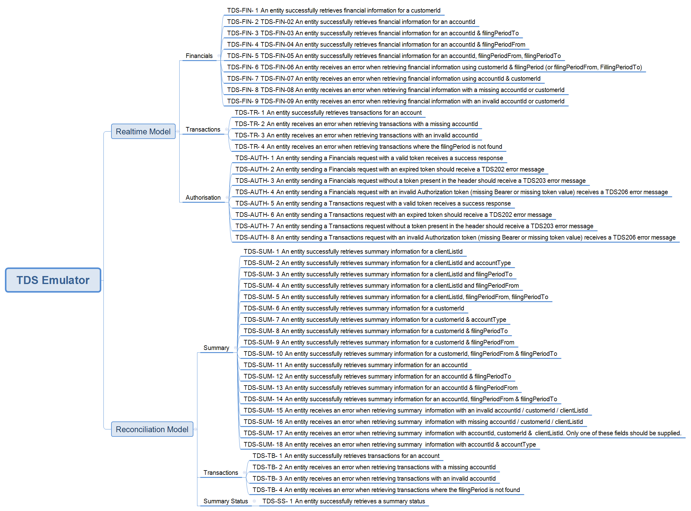

# Transaction Data Services (TDS) API 

The TDS is a suite of business services that provides access to IR customers transaction data for consumption by software packages.  In turn these packages present that data to their users. 
Financial transaction data includes amounts assessed and associated credits or debits.  There is no data sent associated with the details of how an assessment has been calculated

## Environment information

* [Mock environment information - emulated service, scenarios mindmap and test data](#mock-environment-information)
* [Test URL endpoints](#Digital-Testing-Environment-information)
* [Production URL endpoints](#Production-Environment-information)

## About the Emulated Transaction Data Service API

This is an emulated service which emulates the TDS Gateway Service APIs.
It provides static responses for a subset of scenarios invoked on each API. 
>**Please note** that not all requests and responses are emulated.

## TDS API Build Pack

* [Build pack - TDS API](./Build%20pack%20-%20TDS%20API.pdf)

## YAML

* [TDS API YAML](./TDS%20API-20230324.yaml)  
* [View YAML is a Swagger Editor](https://inlandrevenue.github.io/?urls.primaryName=TDS%20API)

### Reconciliation (Batch) Model 
 - Summary Status
 - Summary
 - Transactions/Batch

### Realtime Model
- Financials
- Transactions/Realtime

<a href="mock-environment-information"></a>
# Mock environment information

The hosted service is available at: https://tds-api.test.services.ird.govt.nz (IP Address whitlisting is required)

## Mind Map

The mind map for the emulated service [View larger image](./Images/TDSEmulatorMindMap.png)



### Mock environment authentication
* Consumers of this mock service must be authenticated for the Realtime Model.
* Access delegation/restriction is not emulated, and any authenticated user has access to the test data.
  * OAuth
	* OAuth token issued by the mock OAuth service. Any valid token issued by the mock OAuth service can be used to access this service.
	* Please consult the [mock OAuth service documentation](https://oauth.test.services.ird.govt.nz/) for further details about the authentication process.
	* The OAuth token should be provided in the 'Authorization' request header as follows:
	```
	Authorization: Bearer {OAuthAccessToken}
	```
 

## Test Data

### Summary - Retrieve account summary

| clientListId | linked account |      filing periods       |
|--------------|:--------------:|:-------------------------:|
| 139702328    |      INC       |  2019-03-31, 2021-03-31   |

| customerId    | linked account |       filing periods       |
|---------------|:--------------:|:--------------------------:|
| 139476387     |      FBT       |   2021-12-31, 2022-03-31   |
|               |      GST       |   2021-12-31, 2022-03-31   |
|               |      INC       |   2019-03-31, 2021-03-31   |

| accountId       |       filing periods       |
|-----------------|:--------------------------:|
| 139476387FBT005 |   2021-12-31, 2022-03-31   |
| 139476387GST004 |   2021-12-31, 2022-03-31   |
| 139476387INC002 |   2019-03-31, 2021-03-31   |

### TransactionsBatch / TransactionsRealtime - Retrieve transactions

| accountId       | linked account |           filing periods            |
|-----------------|:--------------:|:-----------------------------------:|
| 139476387INC002 |      INC       |       2019-03-31, 2021-03-31        |

### Financials - Retrieve financials

| customerId | account |     filing periods     |
|------------|:-------:|:----------------------:|
| 139476387  |   FBT   | 2021-12-31, 2022-03-31 |
|            |   GST   | 2021-12-31, 2022-03-31 |
|            |   INC   | 2019-03-31, 2021-03-31 |

### Example JSON requests and responses 

#### /Summary
- [01-accountId_request](./sample%20messages/summary/accountId/01-accountId_request.json)
- [01-accountId_response](./sample%20messages/summary/accountId/01-accountId_response.json)
- [02-accountId-and-filingPeriodFrom_request](./sample%20messages/summary/accountId/02-accountId-and-filingPeriodFrom_request.json)
- [02-accountId-and-filingPeriodFrom_response](./sample%20messages/summary/accountId/02-accountId-and-filingPeriodFrom_response.json)
- [03-accountId-and-filingPeriodTo_request](./sample%20messages/summary/accountId/03-accountId-and-filingPeriodTo_request.json)
- [03-accountId-and-filingPeriodTo_response](./sample%20messages/summary/accountId/03-accountId-and-filingPeriodTo_response.json)
- [04-clientListId_request](./sample%20messages/summary/clientListId/04-clientListId_request.json)
- [04-clientListId_response](./sample%20messages/summary/clientListId/04-clientListId_response.json)
- [05-clientListId-accountType_request](./sample%20messages/summary/clientListId/05-clientListId-accountType_request.json)
- [05-clientListId-accountType_response](./sample%20messages/summary/clientListId/05-clientListId-accountType_response.json)
- [06-clientListId-and-filingPeriodFrom_request](./sample%20messages/summary/clientListId/06-clientListId-and-filingPeriodFrom_request.json)
- [06-clientListId-and-filingPeriodFrom_response](./sample%20messages/summary/clientListId/06-clientListId-and-filingPeriodFrom_response.json)
- [07-clientListId-and-filingPeriodTo_request](./sample%20messages/summary/clientListId/07-clientListId-and-filingPeriodTo_request.json)
- [07-clientListId-and-filingPeriodTo_response](./sample%20messages/summary/clientListId/07-clientListId-and-filingPeriodTo_response.json)
- [08-customerId_request](./sample%20messages/summary/customerId/08-customerId_request.json)
- [08-customerId_response](./sample%20messages/summary/customerId/08-customerId_response.json)
- [09-customerId-and-accountType_request](./sample%20messages/summary/customerId/09-customerId-and-accountType_request.json)
- [09-customerId-and-accountType_response](./sample%20messages/summary/customerId/09-customerId-and-accountType_response.json)
- [10-customerId-and-filingPeriodFrom_request](./sample%20messages/summary/customerId/10-customerId-and-filingPeriodFrom_request.json)
- [10-customerId-and-filingPeriodFrom_response](./sample%20messages/summary/customerId/10-customerId-and-filingPeriodFrom_response.json)
- [11-customerId-and-filingPeriodTo_request](./sample%20messages/summary/customerId/11-customerId-and-filingPeriodTo_request.json)
- [11-customerId-and-filingPeriodTo_response](./sample%20messages/summary/customerId/11-customerId-and-filingPeriodTo_response.json)

- [12-TDS102-accountId-and-accountType_request](./sample%20messages/summary/errors/12-TDS102-accountId-and-accountType_request.json)
- [12-TDS102-accountId-and-accountType_response](./sample%20messages/summary/errors/12-TDS102-accountId-and-accountType_response.json)
- [13-TDS102-missing-required-field_request](./sample%20messages/summary/errors/13-TDS102-missing-required-field_request.json)
- [13-TDS102-missing-required-field_response](./sample%20messages/summary/errors/13-TDS102-missing-required-field_response.json)
- [14-TDS102-accountId-customerId-clientListId_request](./sample%20messages/summary/errors/14-TDS102-accountId-customerId-clientListId_request.json)
- [14-TDS102-accountId-customerId-clientListId_response](./sample%20messages/summary/errors/14.json)
- [15-TDS301-invalid-accountId_request](./sample%20messages/summary/errors/15-TDS301-invalid-accountId_request.json)
- [15-TDS301-invalid-accountId_response](./sample%20messages/summary/errors/15-TDS301-invalid-accountId_response.json)

#### /Transactions
- [01-accountId-and-filingPeriod_request](./sample%20messages/transactions/accountId/01-accountId-and-filingPeriod_request.json)
- [01-accountId-and-filingPeriod_response](./sample%20messages/transactions/accountId/01-accountId-and-filingPeriod_response.json)

- [02-TDS302-accountId-and-invalid-filingPeriod_request](./sample%20messages/transactions/errors/02-TDS302-accountId-and-invalid-filingPeriod_request.json)
- [02-TDS302-accountId-and-invalid-filingPeriod_response](./sample%20messages/transactions/errors/02-TDS302-accountId-and-invalid-filingPeriod_response.json)

#### /Financials
- [01-accountId_request](./sample%20messages/financials/accountId/01-accountId_request.json)
- [01-accountId_response](./sample%20messages/financials/accountId/01-accountId_response.json)
- [02-accountId-filingPeriodTo_request](./sample%20messages/financials/accountId/02-accountId-filingPeriodTo_request.json)
- [02-accountId-filingPeriodTo_response](./sample%20messages/financials/accountId/02-accountId-filingPeriodTo_response.json)
- [03-accountId-filingPeriodFrom_request](./sample%20messages/financials/accountId/03-accountId-filingPeriodFrom_request.json)
- [03-accountId-filingPeriodFrom_response](./sample%20messages/financials/accountId/03-accountId-filingPeriodFrom_response.json)
- [04-customerId_request.json](./sample%20messages/financials/customerId/04-customerId_request.json)
- [04-customerId_response](./sample%20messages/financials/customerId/04-customerId_response.json)  

- [05-TDS102-customerId-and-filingPeriod_request](./sample%20messages/financials/errors/05-TDS102-customerId-and-filingPeriod_request.json)
- [05-TDS102-customerId-and-filingPeriod_response](./sample%20messages/financials/errors/05-TDS102-customerId-and-filingPeriod_response.json)

## Mock Test Report Templates

 * [TDS Transactional Data Services Realtime](TDS%20Replacement%20Services%20RealTime%20-%20Emulators.docx)
 * [TDS Transactional Data Services Reconcilliation (Batch)](TDS%20Replacement%20Services%20Reconcilliation%20-%20Emulators.docx)

<a href="Digital-Testing-Environment-information"></a>
# Digital Testing Environment information

   * Slice Data URL Endpoint: https://test5.services.ird.govt.nz:4046/gateway/tds/
  
## Test Report Templates

 * [TDS Replacement Service Realtime - Test Report Template](TDS%20Replacement%20Service%20Realtime%20-%20Test%20Report%20Template.docx)
 * [TDS Replacement Service Reconciliation (Batch) - Test Report Template](TDS%20Replacement%20Service%20Reconciliation%20-%20Test%20Report%20Template.docx)
 
<a href="Production-Environment-information"></a>
# Production Environment information:

   * URL Endpoint: https://services.ird.govt.nz:4046/gateway/tds/

>***PLEASE NOTE:*** IR requires DSP’s to provide a separate mutual TLS certificate which will be used exclusively for the TDS API /Summary and /transaction/batch.  


## Supporting services
* [Customer Services Suite](https://github.com/InlandRevenue/Gateway_Services-Customer-and-Account/tree/master/Customer%20Services%20Suite)
* [Service - Intermediation](https://github.com/InlandRevenue/Gateway_Services-Access/tree/master/Service%20-%20Intermediation)
* [Service - Software Intermediation](https://github.com/InlandRevenue/Gateway_Services-Access/tree/master/Service%20-%20Software%20Intermediation)
* [Service - Identity and Access](https://github.com/InlandRevenue/Gateway_Services-Access)


