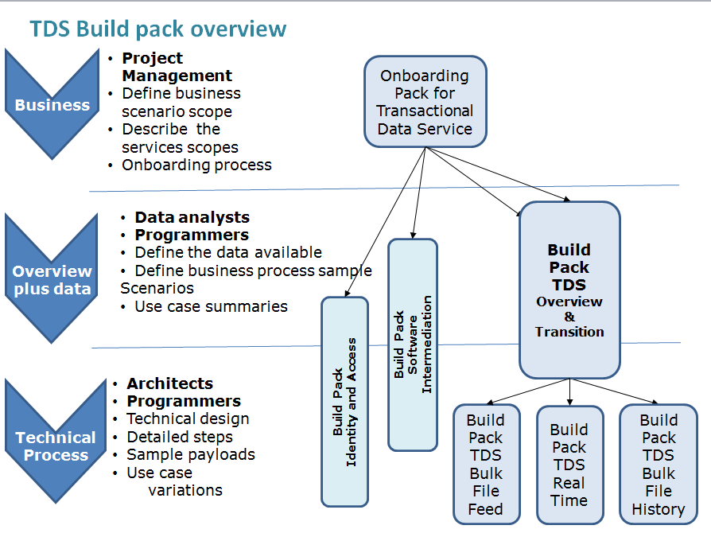

Transaction Data Services (TDS) 
=======================================

The TDS is a suite of business services that provides access to IR customers transaction data for consumption by software packages.  In turn these packages present that data to their users. 
Financial transaction data includes amounts assessed and associated credits or debits.  There is no data sent associated with the details of how an assessment has been calculated

Overview
-------------

View [details in the TDS Overview](TDS%20Overview%20and%20Transition/Latest)

* The Overview and Transition build pack includes: 
	* fundamental concepts for interacting parties using the TDS
	* overview of the bulk file feed, real time feed and history feed services
	* data models and business rules
	* data scenarios and data conversion from the TAWS
	* business use cases
	* delegations and permissions in using TDS.

* Scenarios for 
	* TDS Data Conversion
	* TDS Data 

Key services
-------------

* **Service - TDS Bulk File Feed** - [view details](TDS%20Bulk%20File%20Feed/Latest/) for
	- schemas
	- test data
	- build pack
	
* **Service - TDS Real-Time** - [view details](TDS%20Real-Time/Latest/) for
	- schemas
	- message samples
	- test data
	- build pack
	
* **Service - TDS History Bulk File Feed** - [view details](TDS%20History%20Bulk%20File%20Feed/Latest/) for
	- schemas
	- test data
	- build pack
	
Supporting schema
-------------
* [view Common schema](../Schema%20-%20Common/Common.v1.xsd)

Supporting services
-------------
* [Service - Intermediation](../Service%20-%20Intermediation)
* [Service - Software Intermediation](../Service%20-%20Software%20Intermediation)
* [Service - Identity and Access](../Service%20-%20Identity%20and%20Access/Latest)

